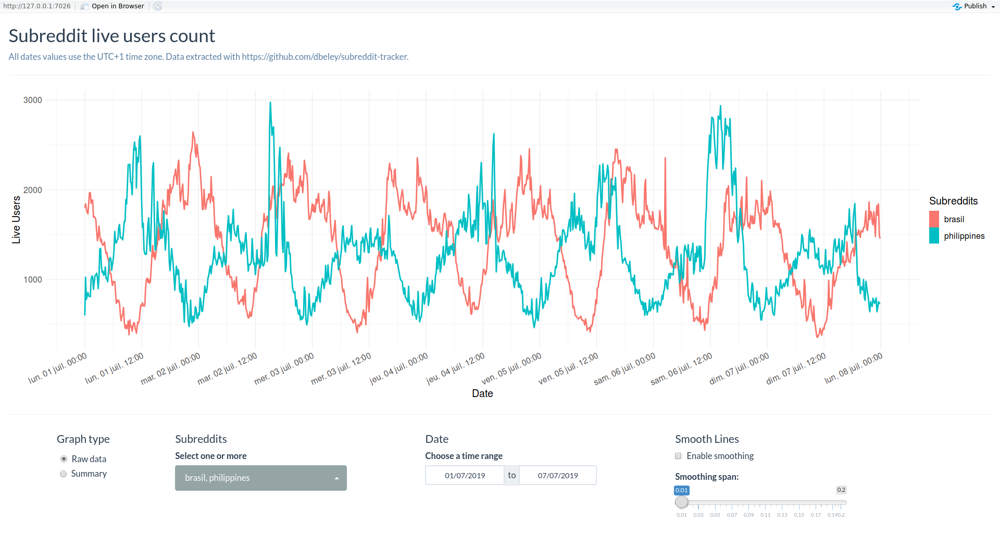

# subreddit-activity-shiny

Simple shiny app for exploring the live users count from a selection of subreddits.

See it live at https://dbeley.shinyapps.io/subreddit-activity-shiny.

Data extracted with [subreddit_tracker](https://github.com/dbeley/subreddit_tracker).

## Gallery

<a href="images/image.png"></a>

## Installation

### Run the app locally from source

- Install rstudio.
- Clone/Download the project on your computer.
- Open the .Rproj file with rstudio to load the R project.
- Open the app.R file.
- Click on the run app button.
- Wait for the dependencies to be installed (can take quite some time as the packages are compiled from source).
- The app should launch after that.

### Run the app locally with runGithub

In rstudio, run the following code :

```
options(Ncpus=4)
install.packages('shiny')
library('shiny')
runGitHub('subreddit-activity-shiny', 'dbeley')
```

## Known Issues

- There are quite a number of outliers in the data. This may be due to an error in the data extraction or in the reddit API.
- When there are missing values, the graph draws a long line connecting the two valid points surrounding the missing range.
- Missing values breaks the smoothing.
- Missing values sometimes breaks the summary graphs.
